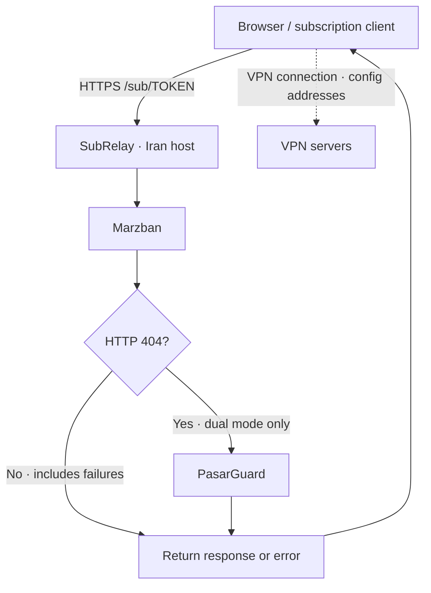

# SubRelay — Iran Subscription Relay

[cPanel upload ZIP](dist/subrelay-cpanel.zip) · [فارسی](README.md) · [cPanel installation](docs/cpanel-install.md)

A small PHP subscription relay for Marzban and PasarGuard on an Iran-hosted dedicated subdomain. No database or Composer; includes a Persian web installer.

**0.1.0 is an initial implementation. Real cPanel deployments, live subscription pages and multiple clients still need acceptance testing.**

| Mode | Routing |
|---|---|
| Marzban | All subscription requests go to Marzban |
| PasarGuard | All subscription requests go to PasarGuard |
| Dual | Marzban first; PasarGuard only after an actual HTTP 404 |

Both panels use `https://sub.example.com/sub/USER_TOKEN`. Tokens must be distinct across panels. There is no token lookup database: the first panel's response determines fallback. Connection failures, TLS failures, timeouts, 401/403 and 5xx never trigger fallback.

## Architecture




Only subscription retrieval and the subscription HTML page pass through the relay. **VPN traffic connects to addresses in the returned configs, directly to VPN servers.** HTML is returned unchanged; templates referencing `/assets`, API paths or external resources need separate configuration. This is not a dashboard/API proxy.

## Requirements

PHP 8.1+, cURL, sessions, valid HTTPS on the public domain and panels, writable install directory, Apache/LiteSpeed-compatible rewrite, and outbound access to panel ports. Use a dedicated subdomain root; subdirectory installs are unsupported.

## Install on cPanel

1. Back up the existing document root, `.htaccess`, and panel public subscription settings.
2. Download the repository ZIP and create a dedicated HTTPS subdomain.
3. Enable **File Manager → Settings → Show Hidden Files**.
4. Upload the **contents of `src/`** to the subdomain's document root, including `.htaccess`.
5. Copy `setup-key.example.php` to `setup-key.php` and replace its value with a unique random secret of at least 24 characters.
6. Visit `/installer.php`, enter the key, select a mode, enter the public origin and upstream subscription prefixes, review connectivity, then confirm.
7. Remove `installer.php`, `setup-key.php` and `install.lock` after installation.
8. Configure panel public URLs and test live links in a browser and subscription clients.

The installer uses a random nonexistent token for its connectivity probe. A 404 is normal; this probe does not verify live subscription functionality or page assets.

Manual installation: copy a mode's file from `examples/` to `config.php` beside `index.php`, replace sample domains, and remove the installer. The public URL is an origin such as `https://sub.example.com`; upstream URLs include the actual subscription prefix, such as `https://panel.example.com/sub` (without a user token). Use the panel's original address, never the relay itself.

## Features and settings

User-Agent/Accept preservation; subscription usage, expiry, title and update headers; strict HTTPS verification; no redirect following; response size cap; query strings and safe format suffixes. Change domains, `order`, `connect_timeout`, `timeout` and `max_bytes` in `config.php`. Dual mode defaults to Marzban then PasarGuard; custom order is supported. Timeouts apply per panel.

Marzban: set `XRAY_SUBSCRIPTION_URL_PREFIX="https://sub.example.com"` and use subscription path `sub`. PasarGuard: set the public subscription prefix in your installed version's settings; see [version notes](docs/pasarguard.md). Regenerate/check a user's public link after applying changes.

## Verify, troubleshoot and roll back

Test live links in a browser, v2rayNG/v2rayN and a Clash-compatible client. Check page rendering, formats, metadata, refresh and the fallback matrix in [testing](docs/testing.md). A 404 may indicate missing rewrite rules, a wrong token or wrong upstream path. A 502 can mean DNS, TLS, outbound firewall, timeout or redirect; fix the certificate chain instead of disabling verification. See [troubleshooting](docs/troubleshooting.md).

Restore backed-up host files and panel URL prefixes to roll back. Previously distributed links must be replaced or kept available separately. On upgrades, preserve `config.php` and back up before replacing code.

```bash
php tests/relay-test.php
python3 tests/http-test.py
```

[Development](docs/development.md) · [MIT](LICENSE) · [Changelog](CHANGELOG.md)
