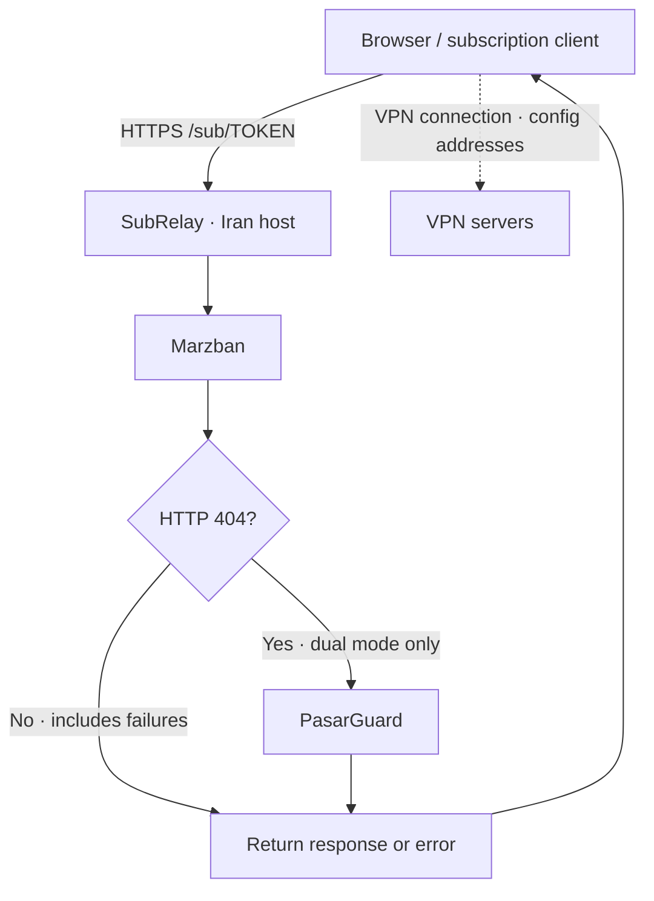
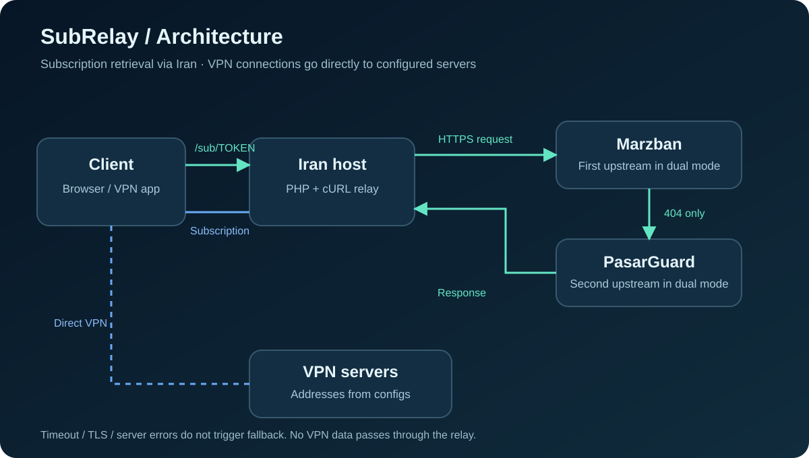

# SubRelay — Iran Subscription Relay

[بسته آماده cPanel](dist/subrelay-cpanel.zip) · [English](README.en.md) · [نصب در cPanel](docs/cpanel-install.md) · [رفع خطا](docs/troubleshooting.md)

واسط سبک PHP برای دریافت اشتراک **Marzban** و **PasarGuard** از دامنه‌ای روی هاست ایران. بدون دیتابیس و با نصب‌کننده وب فارسی، مناسب cPanel و Apache/LiteSpeed با قواعد rewrite سازگار.

> نسخه 0.1.0 نقطه شروع پروژه است. آزمون واقعی هر سه حالت روی cPanel، صفحه ساب و چند کلاینت هنوز لازم است؛ این مخزن ادعای تأیید عملیاتی ندارد.

## سه حالت استفاده

| حالت | عملکرد | راهنما |
|---|---|---|
| مرزبان به ایران | همه درخواست‌ها به مرزبان | [Marzban](docs/marzban.md) |
| پاسارگارد به ایران | همه درخواست‌ها به پاسارگارد | [PasarGuard](docs/pasarguard.md) |
| هر دو به ایران | مرزبان، سپس فقط در صورت 404 پاسارگارد | [Dual panel](docs/dual-panel.md) |

```text
https://sub.example.com/sub/USER_TOKEN
```

در حالت مشترک، توکن‌های دو پنل باید متفاوت باشند. توکن از پیش طبقه‌بندی نمی‌شود؛ پاسخ مرزبان تعیین می‌کند که آیا پنل دوم بررسی شود. خطای اتصال، timeout، TLS، پاسخ 401/403 یا 5xx باعث fallback نمی‌شود. اگر مرزبان برای توکن ناموجود 200 یا 403 برگرداند، این روش مناسب آن نصب نیست.

## معماری






واسط بدنه اشتراک و HTML صفحه ساب را برمی‌گرداند. **ترافیک VPN به آدرس‌های داخل کانفیگ‌ها متصل می‌شود و از هاست ایران عبور نمی‌کند.** فایل HTML بدون بازنویسی منتقل می‌شود؛ قالب‌های وابسته به مسیرهایی مثل `/assets` یا API پنل باید جداگانه اصلاح شوند. این پروژه پروکسی داشبورد یا API نیست.

## ویژگی‌ها

- حفظ User-Agent، Accept و Accept-Language برای انتخاب فرمت توسط پنل.
- انتقال هدرهای مصرف و انقضا (`Subscription-Userinfo`)، عنوان و فاصله به‌روزرسانی پروفایل.
- بررسی اجباری گواهی HTTPS، جلوگیری از دنبال‌کردن redirect و محدودیت اندازه پاسخ.
- پشتیبانی از query string و پسوندهای امن مانند `/clash`، `/sing-box` و `/info`.
- یک کد مشترک برای هر سه حالت؛ دامنه، ترتیب، مسیر upstream و timeout در `config.php`.
- نصب‌کننده فارسی با انتخاب حالت، بررسی اتصال، خلاصه تأیید و قفل بعد از نصب.
- بدون دیتابیس، Composer یا cron. کانفیگ‌ها و کلید نصب واقعی در git ذخیره نمی‌شوند.

## پیش‌نیازها

PHP **8.1+**، افزونه **cURL** و session، HTTPS با گواهی معتبر روی هر دو سمت، دامنه یا زیردامنه اختصاصی، rewrite فعال و دسترسی خروجی هاست به پورت HTTPS پنل. پوشه نصب برای ساخت تنظیمات باید قابل نوشتن باشد. نصب در زیرپوشه پشتیبانی نمی‌شود.

## نصب سریع در cPanel

1. از فایل‌های قبلی و تنظیمات عمومی اشتراک هر پنل بکاپ بگیرید.
2. ZIP مخزن را از **Code → Download ZIP** دانلود کنید. یک زیردامنه مثل `sub.example.com` بسازید و HTTPS آن را فعال کنید.
3. در **File Manager → Settings → Show Hidden Files** فایل‌های مخفی را نمایش دهید.
4. **محتویات** `src/` را در Document Root زیردامنه استخراج کنید؛ `.htaccess` باید کنار `index.php` باشد.
5. `setup-key.example.php` را به `setup-key.php` کپی کنید و متن کلید را با یک مقدار تصادفی اختصاصی حداقل ۲۴ کاراکتری جایگزین کنید.
6. `https://sub.example.com/installer.php` را باز کنید، کلید را وارد کنید، حالت و آدرس‌ها را تعیین کنید، اتصال را بررسی و سپس ذخیره کنید.
7. فایل‌های `installer.php`، `setup-key.php` و `install.lock` را حذف کنید.
8. [آدرس عمومی پنل‌ها را تنظیم](docs/cpanel-install.md#تنظیم-پنل-و-تست) و لینک واقعی را تست کنید.

بررسی نصب‌کننده فقط اتصال HTTPS به مسیری با توکن تصادفی را می‌سنجد؛ پاسخ 404 در آن طبیعی است و صحت endpoint یا صفحه ساب را تضمین نمی‌کند.

### نصب دستی

نمونه حالت دلخواه از `examples/` را به نام `config.php` کنار `index.php` قرار دهید و دامنه‌ها را تغییر دهید. در این روش کلید نصب لازم نیست و نصب‌کننده را حذف کنید.

```php
'public_url' => 'https://sub.example.com', // بدون /sub
'panels' => [
    'marzban' => 'https://marzban.example.com/sub', // مسیر واقعی اشتراک، بدون توکن
    'pasarguard' => 'https://pasarguard.example.com/sub',
],
'order' => ['marzban', 'pasarguard'],
'connect_timeout' => 5,
'timeout' => 20,
```

`order` در حالت مشترک قابل تغییر است؛ رفتار پیش‌فرض و راهنما مرزبان سپس پاسارگارد است. زمان انتظار برای هر پنل جداست و در حالت مشترک مجموع دو درخواست ممکن است تا دو برابر `timeout` طول بکشد.

## تنظیم آدرس عمومی اشتراک

در مرزبان، مقدار `XRAY_SUBSCRIPTION_URL_PREFIX` را روی `https://sub.example.com` تنظیم کنید؛ مسیر اشتراک `/sub` باشد. در پاسارگارد، prefix عمومی لینک اشتراک را در تنظیمات نسخه نصب‌شده روی همان دامنه بگذارید؛ [راهنمای نسخه‌ها](docs/pasarguard.md) را ببینید. آدرس upstream در `config.php` باید همچنان آدرس اصلی پنل باشد و هرگز به خود واسط اشاره نکند.

## تست و رفع خطا

لینک واقعی را در مرورگر باز کنید، سپس در حداقل دو کلاینت مثل v2rayNG/v2rayN و Clash-compatible client وارد کنید. فرمت، مصرف/انقضا، لینک‌های صفحه و به‌روزرسانی را بررسی کنید. [چک‌لیست تست](docs/testing.md) شامل اثبات 404-only fallback است.

| نشانه | بررسی |
|---|---|
| 404 روی همه لینک‌ها | `.htaccess`، rewrite، توکن و مسیر upstream |
| 502 | DNS، timeout، TLS، پورت خروجی یا redirect پنل |
| خطای گواهی | دامنه صحیح و زنجیره کامل گواهی؛ بررسی TLS را خاموش نکنید |
| صفحه ناقص | منابع مطلق/نسبی قالب و وابستگی به API |

جزئیات: [Troubleshooting](docs/troubleshooting.md).

## بازگشت و به‌روزرسانی

برای بازگشت، prefix قبلی پنل‌ها و فایل‌های قبلی هاست از جمله `.htaccess` را از بکاپ برگردانید. لینک‌های عمومی قبلاً ارسال‌شده خودکار تغییر نمی‌کنند. برای ارتقا، `config.php` را نگه دارید و قبل از جایگزینی فایل‌های کد بکاپ بگیرید؛ نمونه‌ها تنظیمات واقعی را بازنویسی نکنند.

## ساختار و توسعه

`src/` فایل‌های هاست؛ `examples/` تنظیمات سه حالت؛ `docs/` آموزش‌ها؛ `assets/` بنر و معماری؛ `tests/` تست منطق و HTTP. [راهنمای توسعه و محدودیت‌ها](docs/development.md).

```bash
php tests/relay-test.php
python3 tests/http-test.py
```

[MIT License](LICENSE) · [Changelog](CHANGELOG.md)
